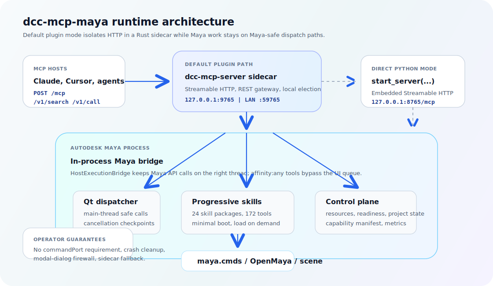

# dcc-mcp-maya

Bring Autodesk Maya to MCP-native AI agents.

`dcc-mcp-maya` turns Maya into a standards-compliant **MCP Streamable HTTP** backend. Agents can inspect scenes, create geometry, edit materials, run animation and render workflows, export assets, and recover project state through typed tools instead of brittle ad-hoc scripts.

The Maya plugin starts a Rust `dcc-mcp-server` sidecar by default, so HTTP and gateway traffic stay isolated from Maya's UI thread while actual Maya API work is routed through Maya-safe dispatchers.

[](https://github.com/loonghao/dcc-mcp-maya/actions/workflows/ci.yml)
[](https://codecov.io/gh/loonghao/dcc-mcp-maya)
[](https://github.com/loonghao/dcc-mcp-maya/releases)
[](https://github.com/loonghao/dcc-mcp-maya/releases)
[](https://github.com/loonghao/dcc-mcp-maya/commits/main/)
[](https://github.com/loonghao/dcc-mcp-maya/issues)
[](https://github.com/loonghao/dcc-mcp-maya/pulls)
[](https://pypi.org/project/dcc-mcp-maya/)
[](https://pypistats.org/packages/dcc-mcp-maya)
[](https://pepy.tech/project/dcc-mcp-maya)
[](https://pypi.org/project/dcc-mcp-maya/)
[](https://www.autodesk.com/products/maya/overview)
[](https://modelcontextprotocol.io/)
[](https://github.com/loonghao/dcc-mcp-core)
[](LICENSE)

## Why Use It

| What you get | Why it matters |
|---|---|
| **198 typed Maya tools** across 25 bundled skill packages | Agents can call validated tools for scene, mesh, material, animation, rigging, dynamics, render, export, pipeline work, and live tool-development diagnostics. |
| **Progressive loading** | Maya boots with a compact tool surface; agents discover unloaded capabilities and load only what they need. |
| **Sidecar isolation by default** | HTTP/gateway runtime is out of Maya's UI thread, with a Qt dispatcher bridge back into Maya. |
| **Multi-instance gateway** | Run several Maya sessions behind one local MCP URL, with optional LAN gateway exposure. |
| **Operational guardrails** | Readiness probes, project persistence, MCP resources, job persistence, crash cleanup, cancellation, and script-execution lockouts. |

## Quick Start

Agent-assisted setup is available if you want an AI agent to install the
Maya-side dependencies, write MCP host config, and walk you through loading the
plugin:

```text
Help me install dcc-mcp-maya using https://github.com/loonghao/dcc-mcp-maya/blob/main/install.md.
```

The agent should follow
[`install.md`](https://github.com/loonghao/dcc-mcp-maya/blob/main/install.md),
which delegates the setup workflow to
[`skills/dcc-mcp-maya-setup`](https://github.com/loonghao/dcc-mcp-maya/tree/main/skills/dcc-mcp-maya-setup).

Install into Maya's Python. Include the `sidecar` extra unless your studio
already ships the `dcc-mcp-server` binary:

```bash
mayapy -m pip install "dcc-mcp-maya[sidecar]"
```

Load the Maya plugin from `maya/plugin/dcc_mcp_maya_plugin.py` with
**Window > Settings/Preferences > Plug-in Manager**. The plugin starts the
Maya bridge, starts or joins the local gateway, and installs the Qt dispatcher
needed by `affinity: main` tools.

Configure your MCP host to the gateway URL:

```json
{
  "mcpServers": {
    "maya": {
      "url": "http://127.0.0.1:9765/mcp"
    }
  }
}
```

Smoke test from your MCP host:

```text
Search for Maya tools, load the maya-primitives skill, and create a cube.
```

For auto-start, copy or source the bundled `maya/userSetup.py`. It defers
plugin loading until Maya is idle and uses the same gateway path as the
Plug-in Manager.

Direct `start_server(port=8765)` is mainly for debugging and `mayapy` scripts.
In Maya GUI, pass a UI dispatcher explicitly:

```python
from dcc_mcp_maya.dispatcher import MayaUiDispatcher, MayaUiPump
import dcc_mcp_maya

dispatcher = MayaUiDispatcher()
MayaUiPump(dispatcher).install()
handle = dcc_mcp_maya.start_server(port=8765, host_dispatcher=dispatcher)
print(handle.mcp_url())  # http://127.0.0.1:8765/mcp
```

If you start the Python server manually this way, point your MCP host at
`http://127.0.0.1:8765/mcp` instead.

## Architecture

<p align="center">
  
</p>

The default plugin path is:

1. MCP host connects to the standalone gateway at `http://127.0.0.1:9765/mcp`.
2. Each Maya plugin starts a per-DCC `dcc-mcp-server sidecar`; the sidecar ensures the machine-wide gateway is running and registers this Maya as a backend.
3. The sidecar calls back into Maya through the Qt event-loop dispatcher.
4. `MayaMcpServer` routes work to typed skills, resources, project tools, readiness, metrics, and the Maya API.

Set `DCC_MCP_MAYA_SIDECAR=0` before loading the plugin to use the legacy in-process gateway path. Newer sidecar binaries also expose the standalone gateway on the LAN at `http://<this-machine-lan-ip>:59765/mcp`; set `DCC_MCP_GATEWAY_REMOTE_PORT=0` to disable that listener. Maya passes explicit sidecar labels (`Maya <version> pid <pid>`), stable `instance_id`, and a machine-level gateway name (`DCC_MCP_GATEWAY_NAME` or `dcc-mcp-gateway@<hostname>`) so `/admin`, `/health`, and CLI `list` can separate gateway ownership from Maya sessions.

## Tool Surface

Default startup is intentionally small: `maya-scripting` and the core `maya-scene` group are available immediately, while other skills stay discoverable through `dcc_capability_manifest`, `search_skills`, and `search_tools`.

| Stage | Purpose | Skills |
|---|---|---|
| `bootstrap` | Escape hatch when no typed skill fits | `maya-scripting` |
| `scene` | Scene lifecycle, DAG, attributes, node graph, viewport display | `maya-scene`, `maya-scene-assembly`, `maya-display`, `maya-attributes`, `maya-node-graph` |
| `authoring` | Meshes, UVs, materials, rigs, animation, dynamics, expressions, lighting | `maya-primitives`, `maya-mesh-ops`, `maya-uv-ops`, `maya-materials`, `maya-material-library`, `maya-texture-bake`, `maya-rigging`, `maya-animation`, `maya-dynamics`, `maya-pose-library`, `maya-expressions`, `maya-light-rig` |
| `interchange` | Geometry and scene I/O | `maya-geometry`, `maya-export-preset` |
| `pipeline` | Project, publish, shot export, render, render farm, development diagnostics | `maya-dev`, `maya-pipeline`, `maya-shot-export`, `maya-render`, `maya-render-farm` |

Typical agent flow:

```text
search_skills / dcc_capability_manifest
  -> load_skill("maya-primitives")
  -> maya_primitives__create_sphere(...)
  -> activate_group("extended") only when optional tools are needed
```

`execute_python` and `execute_mel` remain available as escape hatches, while common plug-in lifecycle work should use `maya_scripting__list_plugins`, `maya_scripting__load_plugin`, and `maya_scripting__unload_plugin`. Production deployments can block arbitrary execution with `DCC_MCP_MAYA_DISABLE_EXECUTE_PYTHON=1`, `DCC_MCP_MAYA_DISABLE_EXECUTE_MEL=1`, or `DCC_MCP_MAYA_DISABLE_ARBITRARY_SCRIPT=1`.

See [`src/dcc_mcp_maya/skills/SKILLS_INDEX.md`](src/dcc_mcp_maya/skills/SKILLS_INDEX.md) for task-to-skill routing examples and [`docs/guide/mcp-tools.md`](docs/guide/mcp-tools.md) for a user-facing tool map.

## Runtime Features

| Feature | Surface |
|---|---|
| Capability manifest | `dcc_capability_manifest({"loaded_only": false})` returns a compact index of loaded and unloaded Maya actions without full schemas. |
| MCP resources | `scene://current`, `maya-cmds://help/<command>`, `maya-cmds://flags/<command>`, `maya-api://signatures/<class>`, `maya-project://current`. |
| Readiness | `/v1/readyz` reports `process`, `dispatcher`, and `dcc` readiness before orchestration routes work to Maya. |
| Project state | `project_save`, `project_load`, `project_resume`, and `project_status` persist state under `<scene_dir>/.dcc-mcp/project.json`. |
| Job persistence | Optional SQLite-backed job storage with `DCC_MCP_MAYA_JOB_STORAGE` and `DCC_MCP_MAYA_JOB_RECOVERY=requeue`. |
| Shutdown hardening | Maya exiting hook, `atexit`, process sentinel, and optional defensive finalizer reduce stale registry rows. |
| Safe sessions | MCP-dispatched Maya jobs suppress blocking modal dialogs and snooze AutoSave unless opted out. |
| Metrics | Optional Prometheus `/metrics` endpoint via `DCC_MCP_MAYA_METRICS=1`. |
| Dev workflow | `maya-dev` can attach a local Python tool project, hot-reload modules, run entrypoints/scripts, start debugpy, and capture Maya UI evidence. |

## Installation

### PyPI

```bash
mayapy -m pip install "dcc-mcp-maya[sidecar]"
```

If your environment already provides `dcc-mcp-server`, the base package is
enough:

```bash
mayapy -m pip install dcc-mcp-maya
```

### Maya Module ZIPs

Release module archives bundle the Maya plugin, `dcc-mcp-maya`, and the
in-process Python bridge dependencies such as `dcc-mcp-core`. They do not bundle
the external `dcc-mcp-server` sidecar binary used by default plugin gateway
mode. On clean machines, install or provide the sidecar runtime before loading
the plugin:

```bash
mayapy -m pip install "dcc-mcp-server>=0.17.35"
mayapy -c "from dcc_mcp_maya.sidecar import resolve_sidecar_binary; print(resolve_sidecar_binary())"
```

Alternatively, set `DCC_MCP_SERVER_BIN` to the sidecar executable, put
`dcc-mcp-server` on `PATH`, or set `DCC_MCP_MAYA_SIDECAR=0` before loading the
plugin to use the legacy in-process gateway path.

### Maya Plugin

1. Put `maya/plugin/dcc_mcp_maya_plugin.py` on `MAYA_PLUG_IN_PATH`.
2. Load it from **Window > Settings/Preferences > Plug-in Manager**.
3. Point your MCP host at `http://127.0.0.1:9765/mcp`.

For auto-start, copy or source the bundled `maya/userSetup.py`. If you maintain
your own `userSetup.py`, load the plugin after Maya is idle:

```python
import maya.cmds as cmds
import maya.utils

maya.utils.executeDeferred(
    lambda: cmds.loadPlugin("dcc_mcp_maya_plugin", quiet=True),
    lowestPriority=True,
)
```

Useful plugin defaults:

| Mode | URL |
|---|---|
| Plugin standalone gateway | `http://127.0.0.1:9765/mcp` |
| Optional LAN gateway | `http://<this-machine-lan-ip>:59765/mcp` |
| Direct `start_server(port=8765)` | `http://127.0.0.1:8765/mcp` |

## Configuration

| Environment variable | Default | Description |
|---|---|---|
| `DCC_MCP_MAYA_PORT` | `8765` direct, `0` plugin | TCP port for the in-process Maya server. Plugin mode uses an OS-assigned instance port by default. |
| `DCC_MCP_MAYA_SERVER_NAME` | `maya-mcp` | Name shown in MCP `initialize`. |
| `DCC_MCP_MAYA_SKILL_PATHS` | none | Maya-specific skill search roots (`;` on Windows, `:` on Unix); each root can be a single skill package or contain child skill packages. |
| `DCC_MCP_SKILL_PATHS` | none | Global fallback skill search roots for all DCC adapters. |
| `DCC_MCP_MINIMAL` | `1` | `0` loads the full tool surface at startup. |
| `DCC_MCP_DEFAULT_TOOLS` | none | Comma-separated skill names to load at startup. |
| `DCC_MCP_MAYA_EXCLUDE_STUBS_FROM_TOOLS_LIST` | `0` | Hide `__skill__*` / `__group__*` stubs from large `tools/list` syncs. |
| `DCC_MCP_MAYA_SIDECAR` | `1` | `0` disables the default plugin sidecar process. |
| `DCC_MCP_SERVER_BIN` | auto | Override the `dcc-mcp-server` binary path. |
| `DCC_MCP_GATEWAY_PORT` | `9765` plugin | Local standalone gateway port; `0` disables gateway mode. |
| `DCC_MCP_GATEWAY_NAME` | `dcc-mcp-gateway@<hostname>` sidecar | Human-readable gateway label shown in admin and CLI diagnostics. |
| `DCC_MCP_GATEWAY_REMOTE_PORT` | `59765` sidecar | LAN gateway listener port; `0` disables remote access. |
| `DCC_MCP_GATEWAY_REMOTE_HOST` | `0.0.0.0` | Bind address for the LAN gateway listener. |
| `DCC_MCP_REGISTRY_DIR` | OS temp dir | Shared FileRegistry directory for service discovery. |
| `DCC_MCP_MAYA_ENABLE_GATEWAY_FAILOVER` | `1` | Allow non-gateway instances to promote themselves on gateway loss. |
| `DCC_MCP_MAYA_ENABLE_WORKFLOWS` | `0` | Enable core workflow tools. |
| `DCC_MCP_MAYA_PROJECT_TOOLS` | `1` | `0` disables `project.*` MCP tools. |
| `DCC_MCP_MAYA_RESOURCES` | `1` | `0` disables MCP resource publishing. |
| `DCC_MCP_MAYA_READINESS_TIMEOUT_SECS` | none | Advisory timeout value for readiness consumers. |
| `DCC_MCP_MAYA_METRICS` | `0` | `1` enables Prometheus `/metrics`. |
| `DCC_MCP_MAYA_JOB_STORAGE` | `<data_dir>/jobs.db` | SQLite job persistence path; set `""` to disable. |
| `DCC_MCP_MAYA_JOB_RECOVERY` | `drop` | `requeue` resumes idempotent interrupted jobs. |
| `DCC_MCP_MAYA_HOT_RELOAD` | `0` | `1` watches skills for disk changes. |
| `DCC_MCP_MAYA_DEV_ROOTS` | none | Optional path-list of trusted roots that `maya-dev` projects must live under. |
| `DCC_MCP_MAYA_FAULTHANDLER` | `1` | `0` disables fatal-signal traceback logging from the Maya plugin. |
| `DCC_MCP_MAYA_SUPPRESS_CRASH_REPORTER` | `0` | `1` suppresses Maya crash reporter dialogs during unattended startup. |
| `DCC_MCP_MAYA_AUTO_DISMISS_CRASH_DIALOG` | `0` | `1` auto-dismisses detected Maya Qt recovery dialogs after main-thread tool calls and surfaces `maya_recovered` in results/context. |
| `DCC_MCP_MAYA_DISABLE_AUTOSAVE` | `1` | `0` opts out of the plugin's AutoSave suppression during MCP jobs. |
| `DCC_MCP_MAYA_SAFE_SESSION` | `1` | `0` disables the modal-dialog firewall around MCP-dispatched jobs. |
| `DCC_MCP_MAYA_DISABLE_EXECUTE_PYTHON` | `0` | Refuse `execute_python`. |
| `DCC_MCP_MAYA_DISABLE_EXECUTE_MEL` | `0` | Refuse `execute_mel`. |
| `DCC_MCP_MAYA_DISABLE_ARBITRARY_SCRIPT` | `0` | Refuse both arbitrary Python and MEL execution. |

### Studio Skill Paths and Rez

`DCC_MCP_MAYA_SKILL_PATHS` is read during server registration/startup and is
split with the platform path separator (`;` on Windows, `:` on Linux/macOS).
Each entry is a skill search root. The scanner accepts either a single skill
package directly or a directory whose immediate children are skill packages:

```text
studio_maya_skills/
└── skills/
    ├── lightbox-maya-dev/
    │   ├── SKILL.md
    │   ├── tools.yaml
    │   └── scripts/
    └── shot-publish/
        ├── SKILL.md
        └── scripts/
```

Rez packages should append the `skills` root in `package.py`:

```python
def commands():
    env.DCC_MCP_MAYA_SKILL_PATHS.append("{root}/skills")
```

`load_skill("lightbox-maya-dev")`, `search_skills`, the gateway `/v1/search`,
and `dcc_capability_manifest` operate on the skills discovered at registration
time. If a Rez context or environment variable changes after Maya has started,
restart/reload the plugin or start the server again so the adapter rescans the
new roots; `load_skill` activates an already discovered skill, but it does not
rescan newly added environment paths.

## Authoring Skills

Skill scripts should lazy-import `maya.cmds` inside the callable so packages can be discovered without a running Maya:

```python
from dcc_mcp_maya.api import maya_success, with_maya


@with_maya
def create_sphere(radius: float = 1.0) -> dict:
    import maya.cmds as cmds

    result = cmds.polySphere(radius=radius)
    return maya_success("Created sphere", object_name=result[0])
```

Every `tools.yaml` entry must declare execution mode and thread affinity:

```yaml
tools:
  - name: playblast
    description: Capture a viewport playblast
    execution: async
    affinity: main
    timeout_hint_secs: 600

  - name: list_export_presets
    execution: sync
    affinity: any
```

Use `affinity: main` for anything touching `maya.*` or scene state. Use `affinity: any` only for pure Python or filesystem work. CI enforces this with `tools/lint_skill_affinity.py`.

Long-running loops should poll cancellation:

```python
from dcc_mcp_maya import check_maya_cancelled, maya_success


def render_frames(frames):
    for frame in frames:
        check_maya_cancelled()
        cmds.currentTime(frame)
        cmds.render()
    return maya_success("Rendered frames", frames=len(frames))
```

## Documentation

- [Getting started](docs/guide/getting-started.md)
- [Installation](docs/guide/installation.md)
- [Standalone mayapy services](docs/guide/standalone.md)
- [Local MCP + debug](docs/guide/local-mcp-debug.md)
- [Multi-instance deployment](docs/guide/multi-instance.md)
- [MCP resources](docs/guide/mcp-resources.md)
- [Tool inventory](docs/guide/mcp-tools.md)
- [Shutdown matrix](docs/guide/shutdown-matrix.md)
- [API reference](docs/api/server.md)

## Development

```bash
git clone https://github.com/loonghao/dcc-mcp-maya
cd dcc-mcp-maya
pip install -e ".[dev]"
pytest tests/
```

Common development commands:

```bash
just verify-deps
just test-quick
just maya-link
just maya-install-core maya-py=/path/to/mayapy
```

Windows PowerShell helpers:

```powershell
just maya-link-win
just maya-install-core-win maya-version=2025
just maya-status-win
just maya-unlink-win
```

Windows symlinks require Developer Mode or an elevated shell. If symlinks are unavailable, the helper scripts fall back to copying files.

## Requirements

- Autodesk Maya 2020+
- Python 3.7+
- `dcc-mcp-core>=0.17.35,<1.0.0`
- Standard sidecar binary for plugin mode: `dcc-mcp-server>=0.17.35`

## License

MIT - see [LICENSE](LICENSE).
